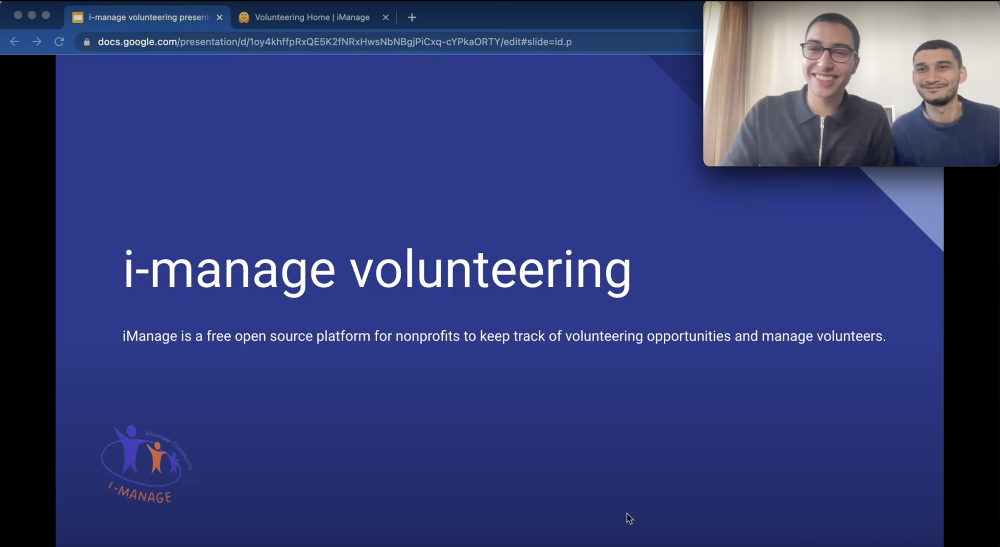

# iManage

[](https://devpost.com/software/i-manage "i-manage volunteering devpost link")


Template forked from: [Material Kit - React](https://material-kit-react.devias.io/)

## Requirements

add firebase config vars to `.env` in the format:
```
FIREBASE_API_KEY = "XXXXXXXXX"
FIREBASE_AUTH_DOMAIN = "XXXXXXXXX"
FIREBASE_DATABASE_URL = "XXXXXXXXX"
FIREBASE_PROJECT_ID = "XXXXXXXXX"
FIREBASE_STORAGE_BUCKET = "XXXXXXXXX"
FIREBASE_MESSAGING_SENDER_ID = "XXXXXXXXX"
FIREBASE_APP_ID = "XXXXXXXXX"
```

Optional: In order to enable email and SMS notifications, you will need to create two free accounts at emailjs.com, and twilio.com and add your ENV variables to the `.env` file:

```
EMAIL_JS_SERVICE_ID = "XXXXXXXXX"
EMAIL_JS_TEMPLATE_ID = "XXXXXXXXX"
EMAIL_JS_PUBLIC_KEY = "XXXXXXXXX"

TWILIO_ACCOUNT_SID = "XXXXXXXXX"
TWILIO_AUTH_TOKEN = "XXXXXXXXX"
TWILIO_MESSAGING_ACCOUNT_SID = "XXXXXXXXX"
TWILIO_MESSAGING_URL = "XXXXXXXXX"
```

#### Install dependencies:
```
yarn install
```

## Running

#### Run in dev mode:
```
yarn dev
```

#### Build:
```
yarn build
yarn start
```

Authors:

[@Marwan01](https://github.com/Marwan01)
[@Mohamedboukari](https://github.com/Mohamedboukari)
